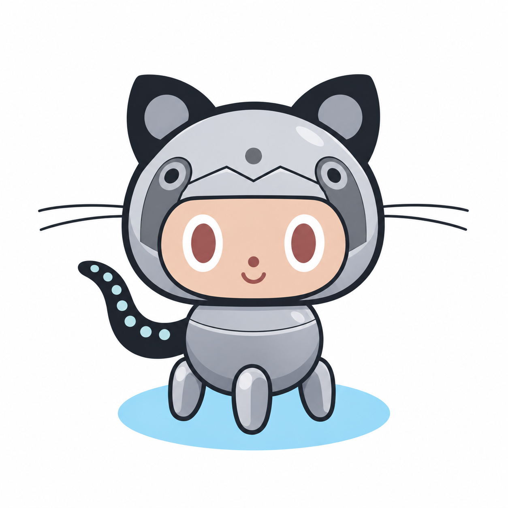

# STEINS;GIT

 
 
A git viewer that draws branches as diverging lines and measures how far each
one has moved away from the default branch. Claude sits behind two buttons, for
the questions a graph cannot answer: what is this branch doing, and can these
two be merged.

No dependencies. Python 3.9, git, and the `claude` CLI if you want the analysis.

```
uvx git+https://github.com/ameroyer/steinsgit /path/to/repo
```

It opens http://127.0.0.1:8787 for you.

Nothing is installed: [uv](https://docs.astral.sh/uv/) fetches the tool into its
own cache, runs it, and leaves your environment alone. It keeps what it fetched,
so add `--refresh` to pick up new commits, or name a tag or commit to pin one:
`uvx git+https://github.com/ameroyer/steinsgit@<ref>`. To keep it around as a
command instead, `uv tool install git+https://github.com/ameroyer/steinsgit`
puts `steinsgit` on your PATH.

From a clone it also runs with nothing but Python, no uv and no install step:

```
./steinsgit.py /path/to/repo
```


https://github.com/user-attachments/assets/1502967a-6b36-4cda-afe1-d79a26803e00


## The number

The nixie tubes show how far a branch has moved from the default branch, from
`0.000000` to just under `2.000000`. It is a weighted sum of six measurements:

| part | weight | meaning |
|---------|------|---------------------------------------------------|
| overlap | 0.28 | files this branch changed that the default branch also changed |
| churn   | 0.18 | lines added and removed |
| ahead   | 0.16 | commits only on this branch |
| age     | 0.14 | days since the two branches split |
| behind  | 0.12 | commits on the default branch this one does not have |
| spread  | 0.12 | how many different files it touched |

Overlap carries the most weight because contested files are the best cheap
predictor of a painful merge. Each part levels off, so going from 2 to 12
commits ahead matters and going from 400 to 410 does not.

Colour shows the same thing. The ramp runs green through gold to orange and
stops there; red read as an error rather than as a long way from home, which is
all a high number means. So does distance:
a branch's column sits out from the trunk in proportion to how far it has
moved, so the branches nearest the middle are the ones nearest to merging.

Commits have their own smaller score for how much they changed. It sets the
size of each dot, so the biggest commits stand out without hovering.

## Reading the canvas

Time goes up. The oldest commit is at the bottom, the newest at the top. The
thick white line in the middle is the default branch. Every other branch is a
line beside it. Circles are commits, diamonds are merges.

A line carries the colour of the branch it belongs to, and the default branch
is white - which is why a line leaving the trunk is not white. It fades from
white into the branch colour along the curve, and the other way when a branch
merges back. Merges are also dashed: a merge edge is the one line that runs
against the grain, carrying a whole branch into another rather than joining a
commit to its parent. A fork stays solid, because a branch starting is not the
same event as one ending.

Zoomed out far enough that the name plates no longer fit, the branch you are
pointing at keeps its plate, and hovering any commit names its branch.

`MARK CLAUDE CO-AUTHORED` rings every commit whose message carries a
`Co-Authored-By` line naming a model, in radioactive green. The author is still
whoever made the commit, so a commit by a person is the normal case; the tooltip
names the model that was credited. Only the name is kept, never the address, so
the tool still never stores an email.

It can only see commits that say so. Work done with a model and committed
without the trailer looks like anything else.

```
drag         move            click a line     pick it as A, then B
             double-click a line   single it out
shift+scroll travel in time  click a dot      open that commit
scroll       zoom            click nothing    clear the selection
f            frame the graph h                help and settings
r            rescan          Esc              clear everything
```

The default branch is always in the middle of the viewport, with a gap either
side of it, so it stays the thing everything else is read against.

Commits are drawn far enough apart to tell one from the next, which means a
long history is taller than the window rather than squeezed into it. The
newest commits are pinned to the top, since that is the end you came for.

## The path between two branches

Click one branch and every commit between it and the default branch lights up,
down to the last commit the two still have in common - the merge base, marked
`COMMON ANCESTOR`. Click a second branch and the highlight switches to the path
between that pair instead.

Everything lit is what happened after the two sides last agreed, which is
exactly the work a merge has to reconcile.

Picking a pair also reframes the view onto them and pushes every other branch
into the background. Deselecting brings the others back.

Double-click a branch to single it out: its column moves to the centre of the
viewport, and the only other branches kept in the foreground are the ones it
forked from, forked into, merged in, or was merged into. Click empty canvas to
come back.

## Filtering

The box above the branch list takes a regular expression. Branches that do not
match are not hidden: they thin out, lose their name plates, and give most of
their width to the ones that do, and the view opens out around what is left.
Their commits and their history stay exactly where they were, so nothing you
were looking at moves out from under you. A curve joining two columns is drawn
only when the branches at **both** of its ends survived the filter, so filtering
to one branch leaves that branch's joins to the trunk and takes away everyone
else's. The view then moves onto what is left and zooms to fit it. Empty the box
to put it all back.

## What Claude does

Pick two branches and press **ASK CLAUDE TO COMPARE**. Before the model is
asked, `git merge-tree` performs a real merge in memory, so the conflict list is
fact rather than a guess. The model gets that result and explains what collides,
in what order to fix it, and what might break that git cannot see.

That merge test wants **git 2.38 or newer**, for `merge-tree --write-tree`. On
older git the same merge runs on a scratch index instead; the answer matches
except that renames are not followed, so a file renamed on one side and edited
on the other is called a conflict where git itself would merge it. Which engine
answered is shown with the result.

**EXPLAIN THESE COMMITS** writes a one-line summary of each commit and of the
branch. A commit's summary is saved against the commit, so one written from a
branch list also shows on that commit's page. A branch's summary is saved
against the branch - it describes a line of work, not the commit its tip
happens to sit on, and several branches can share a tip without sharing a
description.

Every call shows the model, the token count and the cost. Answers are saved and
replayed instead of being paid for twice. **ASK AGAIN** forces a fresh one.

While a run is going the footer shows which step it is on, how far through the
whole run it is, how long it has been going, what the call in flight is doing,
and what it has cost so far - a bar across the top and one line that rewrites
itself. **STOP** ends it. The call already in flight is let go of rather than
killed: it has been paid for either way and the server still saves it, so
stopping costs you that one call and nothing after it.

Loading history and paying a model to read it are separate questions, and the
run has its own two caps. **Explain at most N commits** takes the N newest;
**at most N branches** takes the N most recently touched. Everything else stays
loaded and on the canvas, it is just not read by a model. 0 means no cap.

A run has three parts and they are chosen separately, because they do not cost
remotely the same. Explaining commits sends forty to a call; describing
branches sends one line of context each, thirty to a call. Reviewing them
reads every branch's commits and diffs, **one call per branch on the expensive
model**, which is nearly all of what a full run costs. Untick it to get the
descriptions on their own. A batch is a single call and can take a minute, so
without the progress line the pane prints a line and then sits still, and a
run that is working looks exactly like one that has wedged.

A first look at a repository offers a full pass over it. After that the offer
stops appearing on its own and lives under **HELP → ANALYSE**, which opens with
what has already been written and when, so a second run is an informed decision
rather than a repeat of the first. A run only covers what is missing.

Claude cannot change your repository. That is enforced with process flags, not
by asking it nicely: everything that writes is blocked, and anything that would
ask for permission is denied.

## Trying a merge

**CREATE MERGE WORKTREE** makes a branch in a separate folder and merges there.
Your checkout is untouched. Conflicts are left in place with the files named and
counted. If you already made the same merge test, it says so first.

Clean up when you are done:

```
git worktree remove .steinsgit/worldlines/<name>
git branch -D worldline/<name>
```

## Saved data

Everything expensive is saved in `.steinsgit/knowledge.db`, inside the
repository being analysed rather than next to this tool, and keyed by commit
SHA. If a branch moves the key changes, so an old answer can never be shown for
new code. On 1800 commits a first scan takes about 800 ms and later ones about
40 ms.

Every model answer is stored with the date and time it was produced, the model,
the token count and the cost, and is replayed instead of being bought twice.
Two rules protect it:

- **Nothing a model wrote is ever discarded to save space.** Measurements and
  merge tests are capped, because they can be recomputed for free. Analyses and
  summaries are not, because they cannot. `--forget` is the only thing that
  removes them.
- **Closing the page does not throw away an answer in flight.** The call has
  already been made and paid for by then, so the server stops writing to the
  browser but reads to the end and saves what it gets. Anything cut short is
  marked, and says so when it is replayed.

The export is a single HTML file with the graph, the branch list, every commit
with whatever Claude wrote about it, and a link to each one on GitHub or GitLab
where the repository has a remote. It is laid out like the tool: branches on the
left, whatever you picked on the right. It opens from `file://` with no network.

`--no-cache` turns it off. `--forget` clears it. Because it lives in the
repository, a fresh clone starts with nothing; the HTML export is the copy you
can keep somewhere else or send to somebody.

## Options

```
--days N            how far back to read, in days (default 90, 0 for all)
--max-commits N     cap on commits loaded (default 2000)
--main BRANCH       branch to measure against (found automatically)
--model NAME        model for analysis (default sonnet)
--explain-model NAME  model for bulk summaries (default haiku)
--host / --port     default 127.0.0.1:8787
--no-remotes        ignore remote-tracking branches
--no-open           do not open a browser
--no-cache          do not read or write saved data
--forget            clear saved data at startup
-v, --verbose       log every request
```

## Privacy

Claude sees branch names, commit subjects, file paths and any diff it reads.
Author names are included because they are part of a commit. Author email
addresses are never read.

Exports leave out the repository path, so they carry no home directory or user
name. The server listens on 127.0.0.1 and answers only its own page.

## For developers

See [docs/dev_guide.html](docs/dev_guide.html) for the architecture, the module
map, and how to test without a browser.

## License

MIT. See [LICENSE](LICENSE).

---

*El Psy Congroo.*
